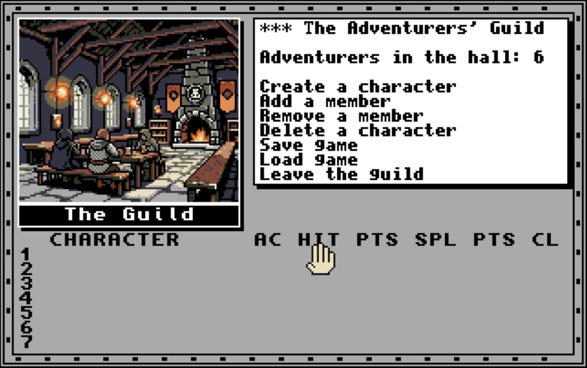
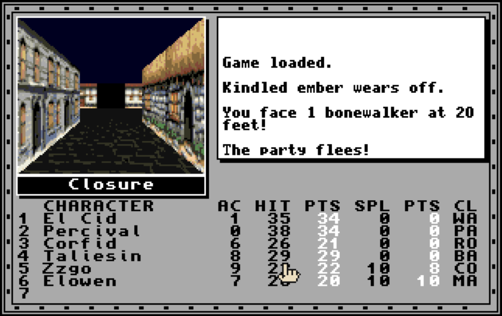
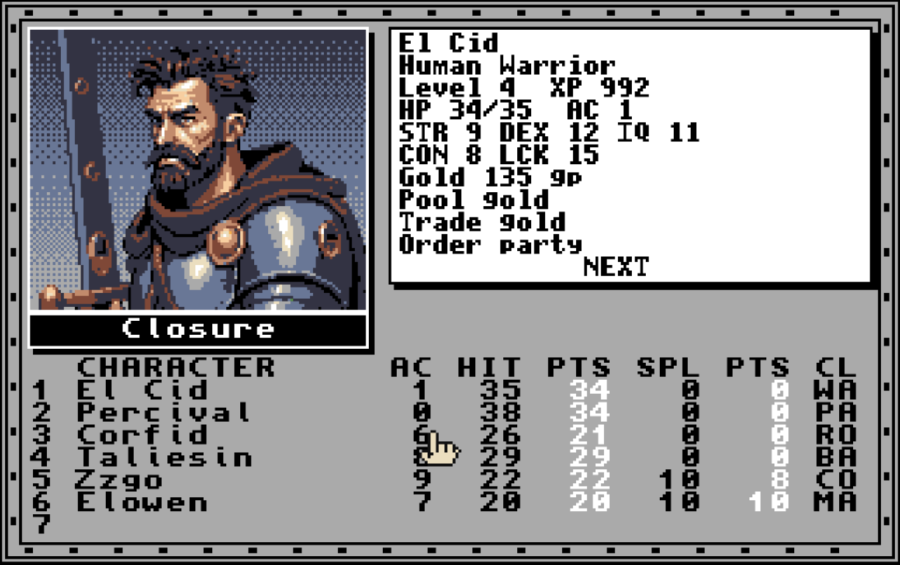
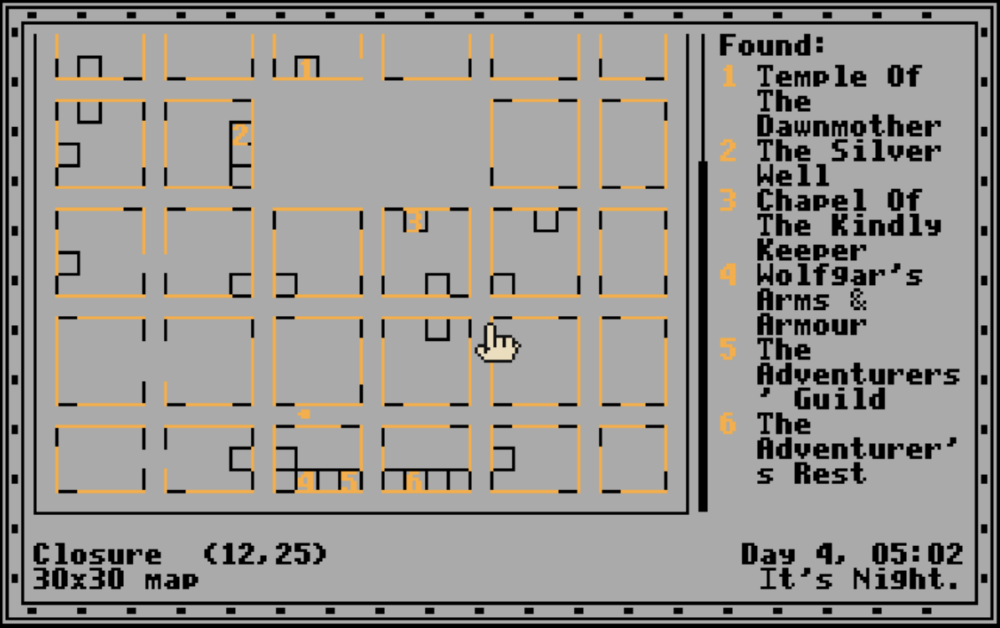

# Lambda's Tale (engine)

A Bard's Tale-style dungeon-crawler **engine** in pure Common Lisp
for clamiga, the cl-amiga runtime.  It runs on the host clamiga for
development and on AmigaOS for play, where it draws in an Intuition
window or on a custom screen of its own.

The engine ships no story.  A **game** is a directory of maps plus a
campaign file, kept in a repo of its own that loads the engine; the
town of [Closure](../closure-tale/README.md) next door is the playable
example, and the engine's own test suite plays a minimal fixture world
in `tests/world/`.

## What a game can look like

These are screenshots of Closure, a game built on the engine, running
on the Amiga in the `:lores` profile.  They show what the engine
does — the split screen, the pages that take over the message area,
the automap — but everything in them that is not chrome comes from
the **game**: the painted street and its houses, the guild's interior,
the hero's portrait, the town's map and the places on it, the names,
the monsters, and the sounds you cannot hear.  The engine ships none
of that.  It ships the mechanics, the screen, and a procedural
placeholder wall pack so that a world with no art of its own still
renders; the fixture world under `tests/world/` is what the engine
looks like on its own.  A game brings its tile packs, sound packs,
pictures, portraits, towns, dungeons and campaign — see [Art and
sound](docs/5-art-and-sound.md) and [Worlds](docs/3-worlds.md).

| | |
|---|---|
|  |  |
| The guild's page takes over the message area, its painted interior in the view column, the roster still empty. | A street in the town at night, in the game's own tile pack; a fight just fled. |
|  |  |
| A character sheet, the hero's portrait beside the stat block. | The automap page: a 30x30 city, the legend of places found, the clock in the footer. |

## The manual

1. **[Getting started](docs/1-getting-started.md)** — build, run the
   suite, walk the fixture world, lay out a world directory, load the
   engine from a game.
2. **[Playing](docs/2-playing.md)** — the screen, every key, the
   mouse, time and light, combat, ailments, locations, saves.
3. **[Worlds](docs/3-worlds.md)** — the map format, the zone form,
   the cell ops, locations and their kinds.
4. **[Campaigns](docs/4-campaigns.md)** — the campaign file: races,
   classes, items, spells, songs, monsters, the party hooks, events
   and flags.
5. **[Art and sound](docs/5-art-and-sound.md)** — tile packs, the pen
   contract, packs from a painting, figures, animated images, sound
   packs.
6. **[Tuning and tooling](docs/6-tuning-and-tooling.md)** — display
   profiles, draw distance, the pack cache, the clock and encounter
   dials, the debug log, the seams for tools.

Design constraints and the reasoning behind some choices live in
`specs/`: [ui-and-engine.md](specs/ui-and-engine.md) is the screen
layout, map scale and platform spec;
[design-notes.md](specs/design-notes.md) explains the display-mode
choice, the layout budget, the asset load path and the menu model;
[effect-sources-and-icons.md](specs/effect-sources-and-icons.md) is an
implemented design sketch, partly superseded; and
[step-animation.md](specs/step-animation.md) is a sketch that is not
implemented.

## Quick start

Build clamiga in the cl-amiga checkout first (`make host` there), then
from this directory:

```
make test    # the engine suite, which plays tests/world/
make assets  # regenerate the default tile packs (data/gfx*)
```

A game loads the engine from wherever it lives and names its starting
map:

```lisp
(load "lambda-tale/src/load.lisp")     ; the engine, vendored as a submodule
(tale:play "mygame/village.map")       ; host front-end
(tale:play-amiga "mygame/village.map") ; AmigaOS front-end
```

[Getting started](docs/1-getting-started.md) has the rest, including
the Amiga launch.

## Engine vs. story

The engine holds **mechanics**; a game holds **content**.  The engine
never hard-codes a story fact, a map, a shop inventory or an item: it
emits events the campaign subscribes to, keeps story state in flags,
and reads everything Closure-shaped from data — hero classes, monsters,
items, spells, songs and maps with cell specials.  When a game needs
something the engine cannot express, the *mechanism* goes here and the
data stays in the game.

## Layout

```
src/package.lisp        package TALE
src/version.lisp        the engine's version + the slots a game fills in
src/debug-log.lisp      the timestamped trace file (TALE_DEBUG_LOG)
src/profiles.lisp       display profiles (:lores / :hires), *ENGINE-DIR*
src/palette.lisp        the pen contract, the day-band tints
src/dice.lisp           dice notation ("2d6+1") and the scriptable *RNG*
src/ilbm.lisp           IFF ILBM reader/writer (pure CL, ByteRun1)
src/map.lisp            dungeon map model + ASCII map parser + story layer
src/knowledge.lisp      the party's automap knowledge
src/view.lisp           first-person view geometry, the blit list, the pack cache
src/game.lisp           game state, movement, effects, zones and travel
src/events.lisp         event bus, story flags, the message log, the menu-line model
src/sound.lisp          8SVX samples and the sound-cue layer
src/races.lisp          races (DEFINE-RACE)
src/party.lisp          heroes, classes, xp/levels, ailments, the character sheet
src/time.lisp           the game clock: day/night, darkness, timed effects
src/items.lisp          item types, packs, equipment, the pack page, the use menu
src/combat.lisp         monster types, round-based combat, wandering monsters
src/specials.lisp       cell-special interpreter (the story op vocabulary)
src/locations.lisp      locations: shop, tavern, temple, energy fount, guild
src/spells.lisp         spell types, spell points, casting + the cast menu
src/songs.lisp          bard songs, tunes, the sing menu
src/save.lisp           save games (readable Lisp data, never evaluated)
src/save-menu.lisp      named saves: the saves/ dir + the slot picker
src/keys.lisp           key normalization and the Amiga menu strip
src/help.lisp           the help page, the quit box, the magic-at-work page
src/microfont.lisp      the display faces the Amiga pages set
src/render.lisp         ASCII automap renderer + the map legend
src/render-fp.lisp      ASCII wireframe first-person renderer
src/host-ui.lisp        host front-end (interactive ASCII walkabout, PLAY)
src/amiga-sound.lisp    AmigaOS audio.device playback
src/amiga-ui.lisp       AmigaOS front-end (Intuition, graphics.library, PLAY-AMIGA)
src/load.lisp           the loader a game loads
data/gfx/*.iff          the default tile pack for :lores (regenerate: make assets)
data/gfx-hires/*.iff    the same pack drawn for the :hires viewport
tools/gen-walls.lisp    procedural wall-art generator
tools/make-assets.lisp  what `make assets` runs
tools/gen-pack-from-art.lisp  a whole pack from one painting (make pack)
tools/preview-view.lisp composite a pack on the host (make preview)
tests/run-tests.lisp    engine test suite (make test)
tests/world/            the fixture world: a keep, a dark crypt, a 30-line campaign
docs/                   the manual
specs/                  design constraints and notes
```

## Tests are the specification

Every feature and every bug fix has a check in `tests/run-tests.lisp`,
and the suite runs on the host and on the Amiga alike (the Amiga run
adds GUI smoke tests for both display profiles and unattended autoplay
sessions).  Where the manual and the suite disagree, the suite is
right; fix the manual.

## Version

`src/version.lisp` holds the engine's version, `MAJOR.MINOR.PATCH`
plus a `DD.MM.YYYY` date, read through `tale:engine-version-string`.
A game has a version of its own that moves independently; see
"The game's version" in [Getting started](docs/1-getting-started.md).
